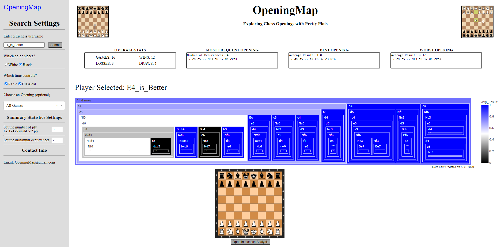

# OpeningMap_App
Opening map is an application for viewing a person's chess games with a unique 2D view. This enables one to easily discern where a player is strong and weak without searching through various openings. All code for storing, parsing, cleaning the Lichess chess games. The Amazon RDS containing the parsed 1.5 billion chess games is not available for public use though. The application is available at https://openingmap.pythonanywhere.com/

